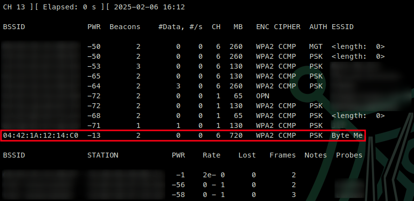

# BurpSuite

[BurpSuite](https://portswigger.net/burp) is industry standard tool for web application hacking, and is essential in any web pentest. Free community edition can be downloaded from [here](https://portswigger.net/burp/communitydownload).&#x20;

Plenty of good info and hands on from the [TryHackMe modules](https://tryhackme.com/module/learn-burp-suite).

## Setup

### Browser Setup

We can install [FoxyProxy](https://foxyproxy.com/) Standard to setup for easy proxy to pass traffic through Burpsuite.

* [Chrome](https://chrome.google.com/webstore/detail/foxyproxy-standard/gcknhkkoolaabfmlnjonogaaifnjlfnp)
* [Firefox](https://addons.mozilla.org/en-US/firefox/addon/foxyproxy-standard/)

With FoxyProxy installed we can right click on the extension > Options

&#x20;

.png>)

Add new Proxy

.png>)

From here, we add the IP to be our machine `127.0.0.1`, and the port to `8080`&#x20;

Then click on the General tab at the tab and give this a name, like Burp or Burpsuite or something.&#x20;

.png>)

Click Save and ta-da!

From here, when we want to use BurpSuite, we can click on the extension icon and select our Burp proxy

 (1) (2).png>)

## Usage

With our browser proxy setup, when we open Burpsuite we can choose a temporary project, or if we have the professional edition we can open exiting projects.

.png>)

When we're ready to start intercepting our traffic, we can go to the proxy tab, and turn on intercept.

 (2) (1).png>)

**\*NOTE** - This will intercept ALL browser traffic. If we want to intercept only specific IPs or websites, we need to setup our scope.

### Scope

Setting a scope for the project allows us to define what gets proxied and logged. We can restrict Burp Suite to _only_ target the web application(s) that we want to test. We can set our scope by Selecting: `Target > Scope`

<figure><figcaption></figcaption></figure>

To do this switch over to the "Target" tab, right-click our target from the list on the left, then choose "Add To Scope". Burp will then ask us whether we want to stop logging anything which isn't in scope, we want to choose yes.

<figure><figcaption></figcaption></figure>

<figure><figcaption></figcaption></figure>

The scope will be sure to only intercept traffic to the specific IPs or websites.

or we can manually add them: `Target > Scope Settings > Include in Scope > Add`

<figure><figcaption></figcaption></figure>

We chose to disable _logging_ for out of scope traffic, but the proxy will still be intercepting everything. So lets turn that off. Proxy > Options/Proxy Settings > Select "AND | URL | Is in target scope". The proxy will completely ignore anything that isn't in the scope, cleaning up the traffic coming through Burp.

<figure><figcaption></figcaption></figure>

### HTTPS Traffic

If we want to intercept HTTPS traffic, we need to do a couple extra steps. When we attempt to, we're met with

<figure><figcaption></figcaption></figure>

Telling us that the PortSwigger certificate isn't authorized to secure the connection. To fix this: with the proxy activated head to [http://burp/cert](http://burp/cert), this will download a file called `cacert.der`.

With that file saved to your machine, open your Firefox setting, then search the page for "certificates" to find the option to "View Certificates" OR under "Privacy & Security" we can view the certificates.

<figure><figcaption></figcaption></figure>

Select "View Certificates" and under the "Authorities" tab, we can import a new cert.

<figure><figcaption></figcaption></figure>

Select "Trust this CA to identify websites" and click OK.

<figure><figcaption></figcaption></figure>

and we're set.

### Burp Browser

There IS an option to start and use the Burp Browser that opens a Chromium window that makes all traffic go through burp without any extra setup, this is not super commonly used to my knowledge as most people prefer to use their browser of choice.

To get to this: `Proxy > Intercept > Open Browser`

<figure><figcaption></figcaption></figure>

### Repeater

Burp Suite Repeater lets us craft and/or relay intercepted requests to a target. It essentially means we can take a request captured in the Proxy, edit it, and send the same request repeatedly as many times as we want.

With a request captured in the proxy, we can send to repeater either by right-clicking on the request and choosing "Send to Repeater" or by pressing `CTRL+R`

<figure><figcaption></figcaption></figure>

Back in the 'Repeater' tab, we can see the request.

<figure><figcaption></figcaption></figure>

We have no response yet, until we press the "send" button at the top left.

<figure><figcaption></figcaption></figure>

To change anything about the request, we can simply type in the Request window and press "Send" again, this will update the Response on the right.

Under reponse, the different tabs:

* **Pretty**: This is the default option. It takes the raw response and makes it easier to read.
* **Raw**: The pure response from the server.
* **Hex**: This view takes the raw response and gives us a byte view of it, useful if the response is a binary file.
* **Render**: The render view renders the page as it would appear in your browser.

## Intruder

Intruder is Burp Suite's in-built fuzzing tool. It lets us to take a request and use it as a template to send many more requests with some altered values automatically. Eg. Capturing a request containing a login attempt, we could configure Intruder to change the username and password fields for values from a wordlist, allowing us to attempt to bruteforce the login.

To access the full speed of Intruder, we need Burp Professional. We can still use Intruder with Burp Community, but it is heavily rate-limited.

Intruder Subtabs:

* Positions allows us to select an Attack Type and configure where in the request template we wish to use in our payloads.
* Payloads allows us to select values to insert into each of the positions we defined in the previous sub-tab.&#x20;
* Resource Pool allows us to divide our resources between tasks. Burp Pro would allow us to run various types of automated tasks in the background, which is where we may wish to manually allocate our available memory and processing power between these automated tasks and Intruder.&#x20;
* Options/Settings sub-tab apply primarily to how Burp handles results and how Burp handles the attack itself. Eg. we can choose to flag requests that contain specified pieces of text or define how Burp responds to redirect (3xx) responses.

### Attack Types

<figure><figcaption></figcaption></figure>

* Sniper
  * Sniper is the first and most common attack type. We give _one_ set of payloads. Eg. This could be a single file containing a wordlist.
* Battering Ram
  * Like Sniper, Battering ram takes a set of payloads. Unlike Sniper, the Battering ram puts the same payload in _every_ position rather than in each position in turn.
* Pitchfork
  * After Sniper, Pitchfork is the attack type you are most likely to use. Its like having numerous Snipers running simultaneously. Where Sniper uses _one_ payload set, Pitchfork uses one payload set per position (up to a maximum of 20) and iterates through them all at once.
* Cluster Bomb
  * Like Pitchfork, Cluster bomb allows us to choose multiple payload sets: one per position, up to a maximum of 20 but Pitchfork iterates through each payload set simultaneously, Cluster bomb iterates through each payload set individually, making sure that every possible combination of payloads is tested.

### Payloads

This tab allows us to choose which position we want to configure a set for as well as what type of payload we would like to use.

When we use an attack type that only allows for a single payload set (Sniper or Battering Ram), the dropdown menu for "Payload Set" will only have one option, regardless of how many positions we have defined.

If we are using one of the attack types that use multiple payload sets (Pitchfork or Cluster Bomb), then there will be one item in the dropdown for each position.

The "payload type" is a "Simple list" lets us load in a wordlist to use. Payload Options differ depending on the payload type we select for the current payload set. Eg. A "Simple List" payload type will give us a box to add and remove payloads to and from the set. We can do this manually using the "Add" text box, paste lines in with "Paste", or "Load..." from a file. Payload Processing allows us to define rules to be applied to each payload in the set before being sent to the target.

Payload Encoding section allows us to override the default URL encoding options that are applied automatically to allow for the safe transmission of our payload.

### Decoder

The Decoder module allows us to manipulate data. We can decode information that we capture during an attack, but we can also _encode_ data of our own.

### Comparer

Comparer allows us to compare two pieces of data, either by ASCII words or by bytes.

### Sequencer

Sequencer is one of those tools that rarely ever gets used in CTFs and other lab environments but is an essential part of a real-world web app penetration test. Sequencer allows us to measure the randomness of "tokens", strings that are used to identify something and should be generated in a "cryptographically" secure manner.

* Live capture is the more common of the two methods, it allows us to pass a request to Sequencer, which we know will create a token for us to analyse. Eg. If we pass a POST request to a login endpoint into Sequencer, the server will respond by giving us a cookie. With the request passed off, we can tell Sequencer to start a live capture. It then makes the same request thousands of times automatically, storing the generated token samples for analysis. Once we have enough samples, we stop Sequencer and allow it to analyse the captured tokens.
* Manual load allows us to load a list of pre-generated token samples straight into Sequencer for analysis. Using this means we don't have to make thousands of requests to our target, which is loud and resource intensive, but it does mean that we need to obtain a large list of pre-generated tokens.
