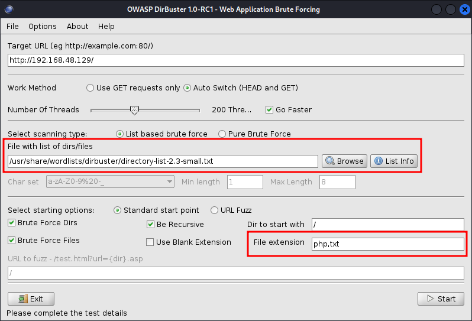

# Files and File contents

## Create

To create a file, we can use the `touch` command.

<figure><figcaption></figcaption></figure>

or we can output commands to a file with `echo` and/or `>`.

<figure><figcaption></figcaption></figure>

## Edit

To edit the files, using the command line, we can use Vi, Vim, or Nano. I prefer nano. This will be basic as both editors have a lot of to them.

### Nano

Nano has some key commands for editing like cut, copy, paste, search, replace, etc. [Here is a quick guide](https://linuxize.com/post/how-to-use-nano-text-editor/).

`nano Hello`

<figure><figcaption></figcaption></figure>

Then to save the file we can to `ctrl+o`, but when exiting nano, we use `ctrl+x`. If we exit without saving, it will ask us if we want to save the file, then ask if we want to change the file name or leave it as is. `ctrl+x > y > enter` is the quick way to save and exit the editor.

### Vi/Vim

`vi Hello` / `vim Hello`

Vi and vim are similar but **vim** is almost a proper superset of **vi**. Meaning everything that is in vi is available in vim. [Here is a VIM cheat sheet](https://vim.rtorr.com/).

<figure><figcaption></figcaption></figure>

To being editing  file in Vi/Vim, you need to press the i key to go into "insert" mode.

<figure><figcaption></figcaption></figure>

The "mode" you are in will be displayed at the bottom left. To exit a mode, press `ESC`.

to save a file, type `:w` and press enter, to quit a file type `:q` and press enter, to both save and quit a file, type `:wq` and press enter.

<figure><figcaption></figcaption></figure>

## View

cat Hello

<figure><figcaption></figcaption></figure>
