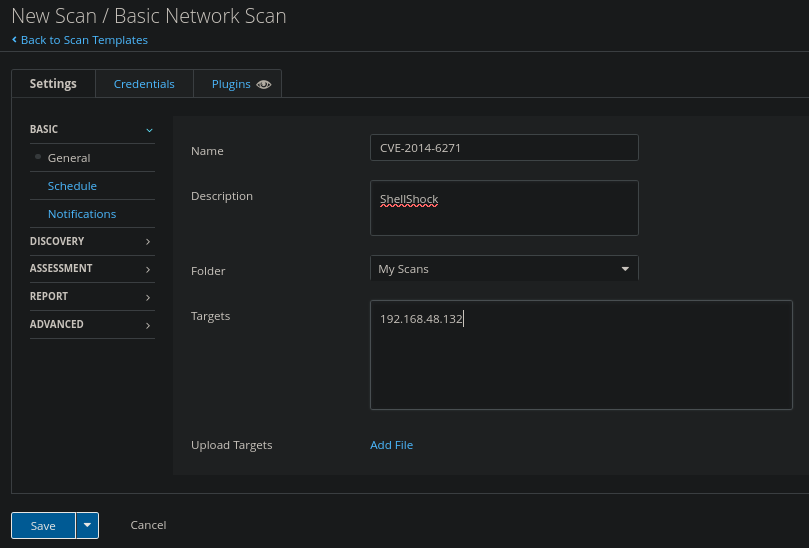
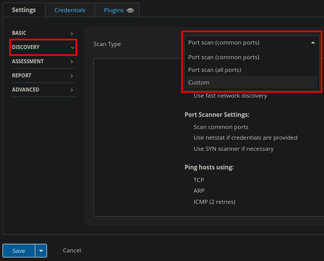
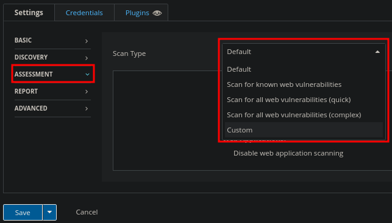

# Nessus

## About

[Nessus](https://www.tenable.com/products/nessus) is a vulnerability scanner from Tenable. Nessus can be deployed on most system, including Raspberry Pi for portability. Can be downloaded form [here](https://www.tenable.com/downloads/nessus?loginAttempted=true), but does require you to make an account to receive a license. On the free account you can scan up to 16 IPs and only private IPs.

So typically when using it for your own environment you want to use the same machines _OR_ set different machines to same IPs you had previously scanned.

Can learn more about Nessus from the [TryHackMe Room](https://tryhackme.com/room/rpnessusredux).

## Usage

### Starting/Stopping/Initializing:

* Start: `sudo /bin/systemctl start nessusd.service`
* Stop: `sudo /bin/systemctl stop nessusd.service`
* Go to [https://localhost:8834/](https://localhost:8834/)

<figure><figcaption></figcaption></figure>

Select the "Register for Nessus Essentials"

<figure><figcaption></figcaption></figure>

Put in your name and email for them to send the license to, OR it will show up on the next screen.

<figure><figcaption></figcaption></figure>

Input a username and password and let it do it's thing.

<figure><figcaption></figcaption></figure>

After initial start and going to the webpage, you will perform choose your edition and input necessary info(user, password, license, etc), it will run through and setup.

.png>)

## Scanning

They have multiple types of scans to use.

<figure><figcaption></figcaption></figure>

I used [Pentester Lab: CVE-2014-6271: ShellShock](https://www.vulnhub.com/entry/pentester-lab-cve-2014-6271-shellshock,104/) to scan against.

<figure><figcaption></figcaption></figure>

<figure><figcaption></figcaption></figure>

Since i will be scanning against `192.168.42.132`, we will do a basic scan. "New Scan" in the top right, we will give it a name, and the IP or IP range we want to attack.

<figure><figcaption></figcaption></figure>

We can schedule the can to happen at a later date/time, or schedule a reoccurring scan.

Under "Discovery" we can set the type of scan. By default it is set to Common ports.

<figure><figcaption></figcaption></figure>

Under "Assessment" we can change the scan type as well.

<figure><figcaption></figcaption></figure>

We can do additional settings in "Report" and "Advanced" as well. Usually these are kept default.

Save the scan and run it.

Selecting the scan while it runs will show us details as it runs

<figure><figcaption></figcaption></figure>

One it's finished we can click the scan to get results of each vulnerability found and it's details by clicking the vulnerability.

<figure><figcaption></figcaption></figure>

<figure><figcaption></figcaption></figure>

<figure><figcaption></figcaption></figure>

This tell us what the vulnerability is exploitable with as well.

<figure><figcaption></figcaption></figure>

We can also see recommendations on how to fix the vulnerabilities.

<figure><figcaption></figcaption></figure>

There is much more to Nessus, though may be limited using a free version.
